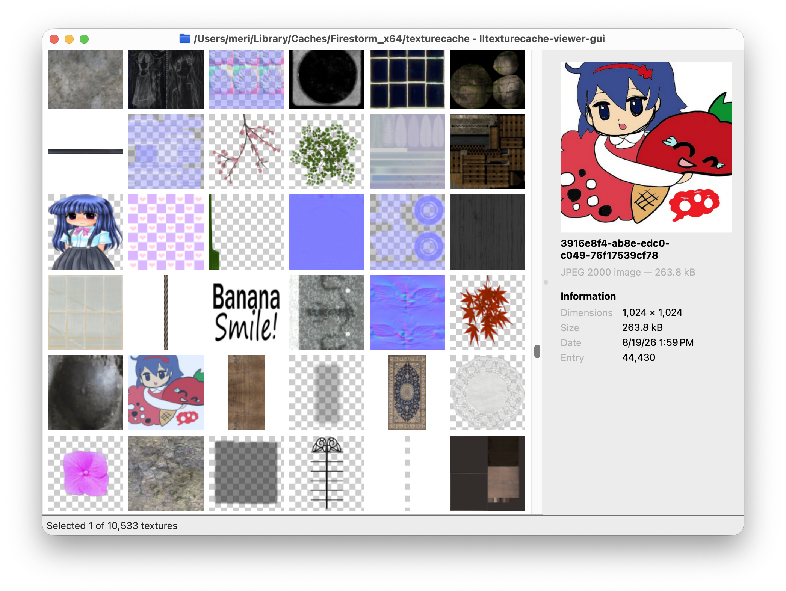

# lltexturecache-browser-qt



a cross-platform user interface for the Second Life texture cache.

## Goals

- browse, sort and filter through a large amount of textures in a cache
- save textures to disk in a commonly-used image format
- be fast and out of the way

## develop

use [uv](https://docs.astral.sh/uv/) to run the app in a development context

```bash
uv run lltexturecache-browser-qt
```

## Build

use [uv](https://docs.astral.sh/uv/) to build the app for the host platform.
macOS gets a `.app`, Windows a `.exe` and Linux a binary.

```bash
./scripts/build
```

linux requires `patchelf` and `libxcb-cursor0` on the `PATH`.

## release

publishing a GitHub release builds for all platforms and attaches the binaries
to it. it can be triggered like this:

```bash
./scripts/release.sh major|minor|patch
```

it bumps the version, commits the bump, tags it, pushes both and creates the release.

if you want to sign and/or notarize the app, the following secrets should be set in the deployment pipeline:

| secret                       | is a                                                            | used for     |
| ---------------------------- | --------------------------------------------------------------- | ------------ |
| `MACOS_CERTIFICATE`          | developer ID Application certificate as `.p12`, base64 encoded  | signing      |
| `MACOS_CERTIFICATE_PASSWORD` | password the `.p12` was exported with                           | signing      |
| `MACOS_SIGN_IDENTITY`        | e.g. `Developer ID Application: Your Name (TEAMID)`             | signing      |
| `APPLE_ID`                   | Apple ID the app-specific password belongs to                   | notarization |
| `APPLE_APP_PASSWORD`         | [app-specific password](https://support.apple.com/en-us/102654) | notarization |
| `APPLE_TEAM_ID`              | ten character team ID                                           | notarization |
