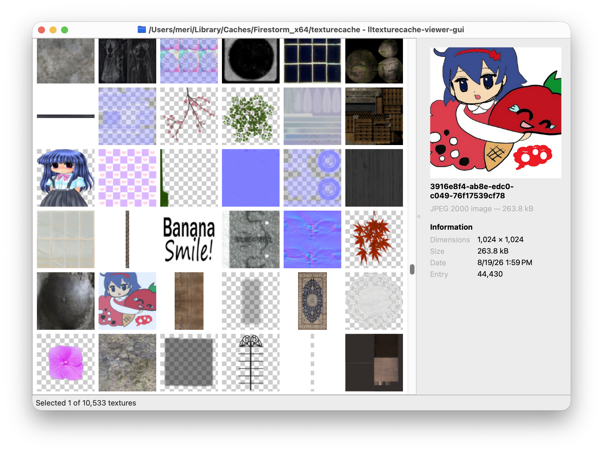

# TextureFriend

<p align="center">
  
</p>

TextureFriend is a cross-platform tool to browse and export textures
from the second life texture cache.

this application is useful if you want to mod existing assets on second life,
like character clothing and the author does not provide a texture to download.

TextureFriend can only read what is stored in your cache files. it
never connects to second life directly.

the app's icon, slcachegirl, is designed by
[@sferics32.bsky.social](https://bsky.app/profile/did:plc:omeuiwhg6nfnwdorlfxtszei).

## features

- browse and filter through a large amount of textures
- find a texture by a screenshot
- save to disk in commonly-used image formats
- drag and drop support
- it's fast
- it's not an electron app


## install

windows, linux and mac builds can be downloaded from
[GitHub releases](https://github.com/furudean/texturefriend/releases/latest)

on mac, you may install with homebrew, from the 
[homebrew tap](https://github.com/furudean/homebrew-tap/tree/main):

```bash
brew install --cask furudean/tap/texturefriend
```

### install requirements

| platform | runs on                                     |
| -------- | ------------------------------------------- |
| mac      | macos 13 ventura or later, any arch         |
| windows  | windows 10 or later, x86-64                 |
| linux    | glibc 2.35 or later (ubuntu 22.04+), x86-64 |

## hacking

to build from source or run as dev, see [HACKING.md](HACKING.md).

## prior art

- [SLCacheViewer](http://slcacheviewer.com/)
- [texture-courier](https://github.com/furudean/texture-courier)
